# Apartman İnşaatı Simülasyonu (C dili - Process & Thread Modeli)

---

## 📅 Proje Bilgisi

**Ders:** İşletim Sistemleri (2024-2025 Bahar Dönemi) <br>
**Hazırlayanlar:**

* Yasin Ekici (21360859029)
* Eren Özer (22360859030)
   
Grup No: 8

---

## 📈 Amaç

Bu proje, C dili kullanarak çoklu işlem (multi-process) ve çoklu iş parçacık (multi-threading) yapıların senkronize edilmesini modellemektedir. Temel hedef, işletim sistemi dersinde öğrencilerin mutex, semaphore, process/thread senkronizasyonu gibi kavramları anlaması ve uygulamasıdır.

Simülasyon, bir apartmanın kat ve daire bazlı inşaatını temsil eder. Her kat ayrı bir **process**, her daire o kat içinde ayrı bir **thread** olarak tasarlanmıştır.

---

## 🏠 Sistem Mimarisi

* **Kat Sayısı:** 10

* **Daire Sayısı (Her Kat):** 4

* **Toplam Daire:** 40

* **Process Tabanlı Model:**

  * Her kat `fork()` ile oluşturulan ayrı bir process.
  * Katlar sırayla başlar: Üst kat, alt kat bitmeden başlamaz.

* **Thread Tabanlı Model:**

  * Her daire için bir `pthread_create()` ile thread oluşturulur.
  * Aynı kat içindeki daireler eşzamanlı başlar.

* **Kaynaklar ve Senkronizasyon:**

  * 2 su tesisatçısı (semaphore)
  * 2 elektrikçi (semaphore)
  * 1 su çekici (semaphore)
  * 1 itfaiyeci (semaphore)

* **Paylaşımlı Veriler:**

  * `daire_durumlari[][]` dizisi: her dairenin durumunu saklar.
  * `daire_kilitleri[][]`: her daire için mutex kilidi

* **Durum Kodları (Ekran Çıktıları):**

  * ⬜: Başlanmamış
  * 🟦: Su tesisatı tamamlanıyor
  * 🟨: Elektrik tesisatı tamamlanıyor
  * 🟩: Tamamlandı
  * 🟪: Su baskını
  * 🟥: Yangın

---

## ⚡ Örnek Simülasyon Çıktısı

```
=== KAT 1 İNŞAATI BAŞLADI ===
[Kat 1] Daire 1 -> İnşaat başladı (Thread 139902408881920)
[Kat 1] Daire 1 -> SU TESİSATÇISI [T1] GİRİYOR 💧
...
[Kat 1] Daire 1 -> SU TESİSATI TAMAMLANDI ✅ (T1)
...
=== KAT 1 TAMAMLANDI ===
```

Ayrıca tum olaylar `log.txt` dosyasına yazılır.

---
## 🧪 Test ve Değerlendirme Dosyaları

Aşağıdaki betikler, simülasyonun performansını ve farklı konfigürasyonların etkilerini ölçmek amacıyla hazırlanmıştır. Her biri belirli bir senaryoya odaklanır ve sonuçları `.csv` formatında kayıt altına alır.

### 1. `profile.sh`

- Simülasyonun sistem kaynak tüketimini ölçer.
- `/usr/bin/time` komutu ile çalışır.
- Sonuçlar: `results/resource_usage.log` dosyasına yazılır.
- Ölçülen metrikler:
  - Kullanıcı zamanı (`User_time`)
  - Çekirdek zamanı (`Sys_time`)
  - Maksimum bellek kullanımı (`Max_RSS`)
  - Gönüllü ve zorunlu context switch sayıları

### 2. `param_sweep.sh`

- `TESISATCI_SAYISI` ve `ELEKTRIKCI_SAYISI` parametreleri 1'den 4'e kadar denenir.
- Her parametre kombinasyonu için simülasyon çalıştırılır.
- Toplam süre ölçülerek `results/param_sweep.csv` dosyasına yazılır.
- Performans kıyaslaması yapılarak kaynak sayısının etkisi analiz edilir.

### 3. `error_sweep.sh`

- `ERROR_RATE` makrosu 0, 5, 10 ve 20 olarak set edilir.
- Hata oranları değiştikçe yangın ve su baskını olaylarının simülasyonu yapılır.
- Her hata oranı için simülasyon süresi `results/error_sweep.csv` dosyasına yazılır.
- Gerçekçilik ve dayanıklılık testleri yapılır.

### 4. `scale_sweep.sh`

- Kat sayısı (`KAT_SAYISI`) 10, 15, 20 olarak; daire sayısı (`DAIRE_SAYISI`) 4, 6, 8 olarak denenir.
- Farklı bina boyutlarında performans karşılaştırması yapılır.
- Her kombinasyon için simülasyon çalıştırılarak toplam süre `results/scale_sweep.csv` dosyasına kaydedilir.

### 5. `repeated.sh`

- Simülasyon 2 kez art arda çalıştırılır.
- Her çalıştırma sonrası:
  - Toplam simülasyon süresi
  - En hızlı daire süresi
  - En yavaş daire süresi
- Sonuçlar `results/summary.csv` dosyasına yazılır.

---
## 📆 Kullanım Talimatları

### Gereksinimler

* GCC
* POSIX pthread kütüphanesi
* Linux terminal ortamı

### Derleme

```bash
make
```

Oluşan çalıştırılabilir dosya `apartman` adını alır.

### Çalıştırma

```bash
./apartman
```

Simülasyon başladığında bina durumu terminale ASCII olarak yansıtılır.

### Test Kodlarını Çalıştırma

```bash
make repeated
make param
make error
make scale
make profile
```
Kodların aynı anda çalıştırılmamasına dikkat edilmesi gerek. Tek tek çalıştırılmalı.

---

## 🔍 Dosya Açıklamaları

| Dosya Adı            | Açıklama                                                                 |
|----------------------|--------------------------------------------------------------------------|
| `main.c`             | Simülasyonu başlatır, `fork()` ile katlar oluşturulur. Performans ölçümü ve raporlama yapılır. |
| `bina.c`             | Senkronizasyon, loglama, durum yönetimi, ASCII arayüz ve işçi yönetimi içerir. |
| `daire.c`            | Her dairede çalışan thread mantığı, olay sıralamaları (su, elektrik), hata senaryoları simülasyonu. |
| `bina.h`             | Tüm sabit tanımlar, global değişkenler ve fonksiyon prototiplerini içerir. |
| `Makefile`           | Derleme talimatlarını içerir. `apartman` adlı çalıştırılabilir dosyayı oluşturur. |
| `report.txt`         | Simülasyon tamamlandıktan sonra oluşturulan genel performans raporudur. |
| `insa_suresi.csv`    | Her dairenin başlama, bitiş zamanı ve toplam sürelerini listeler.         |
| `log.txt`            | Tüm olayların detaylı log kaydını içerir. Konsol çıktısının sadeleştirilmiş halidir. |
| `profile.sh`         | Simülasyonun sistem kaynak kullanımını analiz eder.                      |
| `param_sweep.sh`     | Su tesisatçısı ve elektrikçi sayılarının etkisini analiz eder.           |
| `error_sweep.sh`     | Hata oranı değişimlerinin simülasyon süresine etkisini test eder.        |
| `scale_sweep.sh`     | Kat ve daire sayısı ölçeklendirme testi yapar.                           |
| `repeated.sh`        | Simülasyonun birden fazla kez çalıştırılması ile performans kıyaslaması yapar, `summary.csv` üretir. |


---

## ⚠️ Hata Senaryoları & Yeniden Başlatmalar

* **Yangın** (%10 ihtimal):

  * Elektrik tesisatı sırasında çıkar
  * İtfaiyeci müdahale eder, daire baştan başlar

* **Su Baskını** (%10 ihtimal):

  * Su tesisatında olur
  * Su çekici müdahale eder, tesisat yeniden başlar

---

## 📸 Örnek Çıktı ve Görseller

Aşağıda simülasyonun çıktılarından alınan bazı ekran görüntüleri bulunmaktadır. Bu görseller loglar, csv içerikleri ve terminal çıktılarının örneklerini sunar.

### 🖥️ Terminal Çıktıları

<table>
  <tr>
    <td align="center"><strong>terminal_ciktisi_1</strong></td>
    <td align="center"><strong>terminal_ciktisi_2</strong></td>
    <td align="center"><strong>terminal_ciktisi_3</strong></td>
  </tr>
  <tr>
    <td>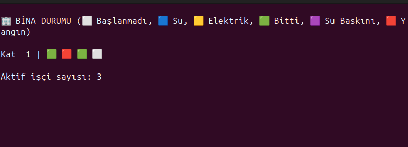</td>
    <td>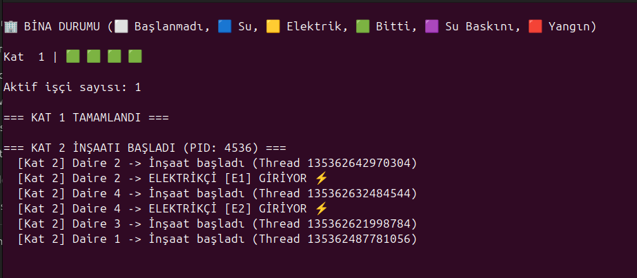</td>
    <td>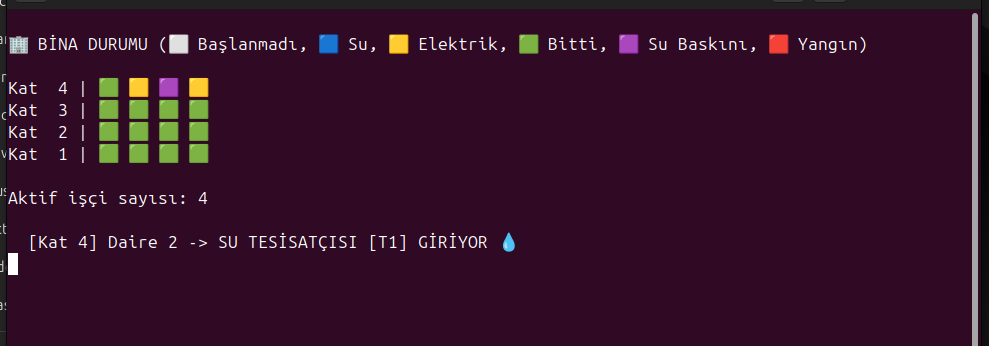</td>
  </tr>
  <tr>
    <td align="center"><strong>terminal_ciktisi_4</strong></td>
    <td align="center"><strong>terminal_ciktisi_5</strong></td>
    <td></td>
  </tr>
  <tr>
    <td>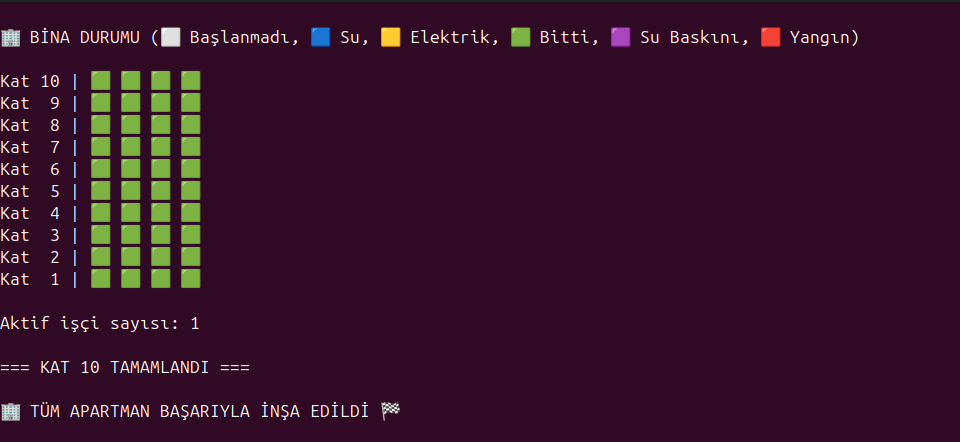</td>
    <td>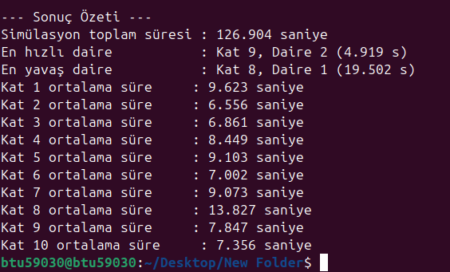</td>
    <td></td>
  </tr>
</table>

---

### 🧾 Loglar ve Raporlar

<table>
  <tr>
    <td align="center"><strong>insa_suresi.csv</strong></td>
    <td align="center"><strong>log.txt</strong></td>
    <td align="center"><strong>report.txt</strong></td>
  </tr>
  <tr>
    <td>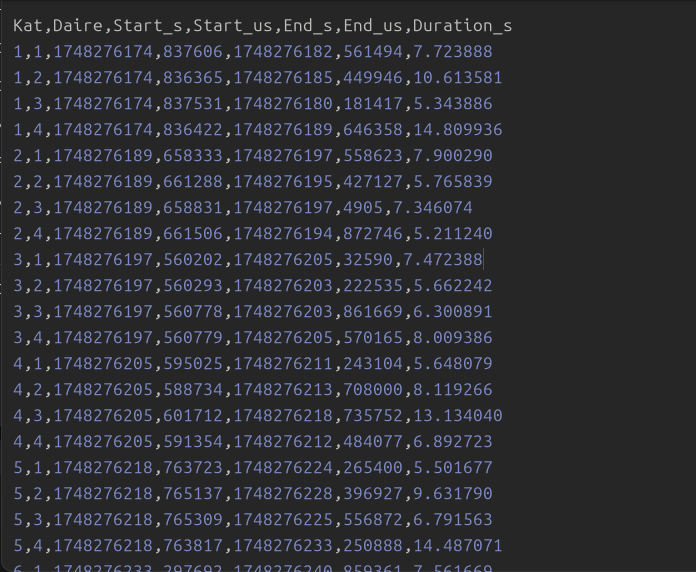</td>
    <td>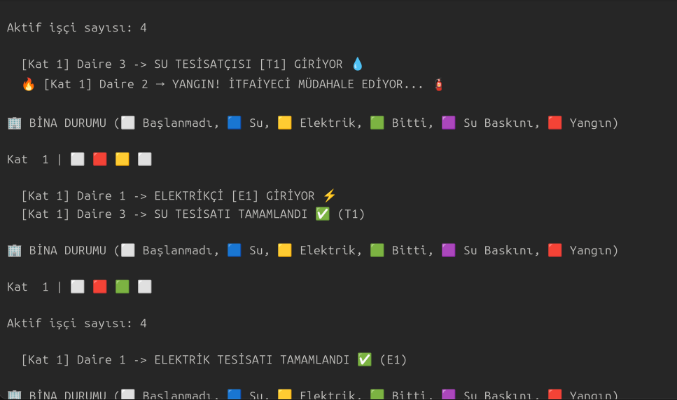</td>
    <td>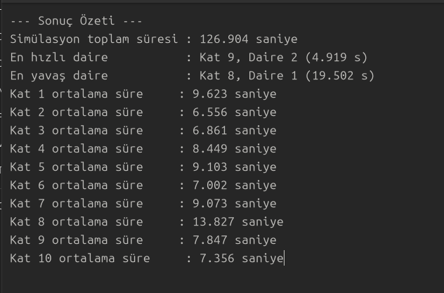</td>
  </tr>
</table>

---

## 🔁 Betik ve CSV Çıktıları

<table>
  <tr>
    <td align="center"><strong>repeated.sh</strong></td>
    <td align="center"><strong>summary.csv</strong></td>
    <td align="center"><strong>param_sweep.sh</strong></td>
  </tr>
  <tr>
    <td>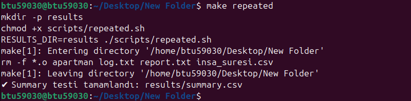</td>
    <td>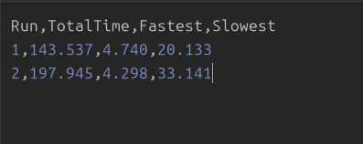</td>
    <td>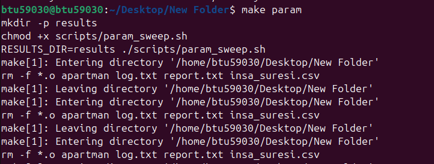</td>
  </tr>

  <tr>
    <td align="center"><strong>param_sweep.csv</strong></td>
    <td align="center"><strong>error_sweep.sh</strong></td>
    <td align="center"><strong>error_sweep.csv</strong></td>
  </tr>
  <tr>
    <td>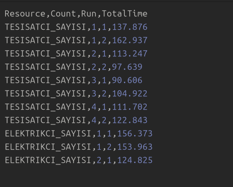</td>
    <td>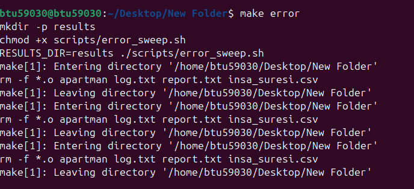</td>
    <td>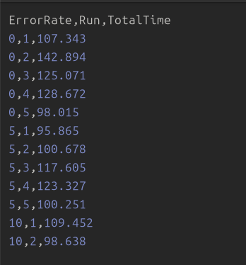</td>
  </tr>

  <tr>
    <td align="center"><strong>scale_sweep.sh</strong></td>
    <td align="center"><strong>scale_sweep.csv</strong></td>
    <td align="center"><strong>profile.sh</strong></td>
  </tr>
  <tr>
    <td>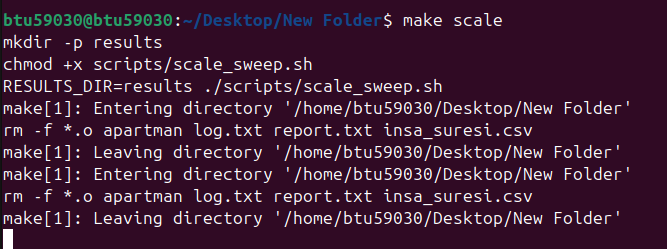</td>
    <td>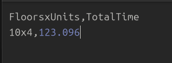</td>
    <td>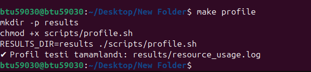</td>
  </tr>

  <tr>
    <td align="center" colspan="3"><strong>profile_sh çıktı: resource_usage.log</strong></td>
  </tr>
  <tr>
    <td colspan="3" align="center">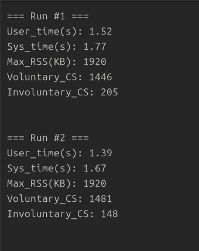</td>
  </tr>
</table>


---

## 🛠 Geliştirme Notları

* Tüm paylaşımlı kaynaklara mutex ve semaphore mekanizmaları eklendi.
* Yarış durumları, özel kilitlerle güvenli şekilde çözüldü.
* ASCII grafik arayüz ile kullanıcı dostu çıktı sağlandı.
* Geliştirme sürecinde, threading ve process oluşturmanın kombinasyonel zorluklarına karşı detaylı testler yapıldı.

---

## 📁 Proje Klasör Yapısı

```
apartman-simulasyonu/
├── bina.c
├── bina.h
├── daire.c
├── main.c
├── Makefile
├── insa_suresi.csv (çalışma sırasında otomatik oluşturulur)
├── report.txt (çalışma sırasında otomatik oluşturulur)
├── log.txt (çalışma sırasında otomatik oluşturulur)
│
├── scripts/
│ ├── error_sweep.sh
│ ├── param_sweep.sh
│ ├── profile.sh
│ ├── repeated.sh
│ └── scale_sweep.sh
│
├── results/   (çalışma sırasında otomatik oluşturulur)
│ ├── error_sweep.csv 
│ ├── param_sweep.csv 
│ ├── resource_usage.log 
│ ├── scale_sweep.csv 
│ └── summary.csv
│
├── images/
  └── ...
```


